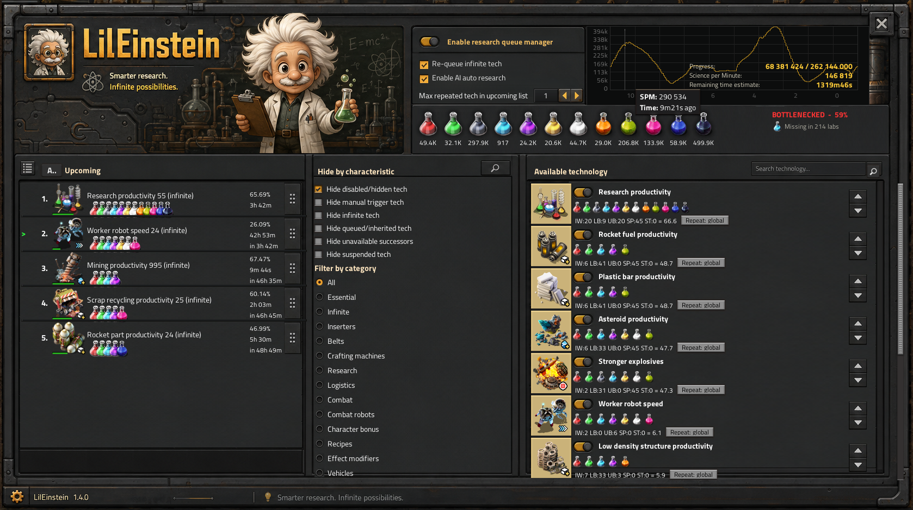

# LilEinstein

> A science-aware research autopilot for Factorio 2.0.
> Strategy profiles, supply forecasting, lab-cluster scheduling, queue budgets, repeat policies, plan presets, and multiplayer controls.

  

  
  
  

## Overview

LilEinstein turns research into a managed system instead of a manual queue.
It chooses technologies, tracks science supply, manages repeat rules, and keeps the queue aligned with your current goals.

## Key features

- Strategy profiles for cheapest-first, focused progression, logistics, combat, space, spoilable science, and productivity.
- Per-science priorities with availability hysteresis, flow forecasts, and starvation prediction.
- Surface- and logistic-network-aware lab supply clusters.
- Queue-wide budgets, deficits, completion estimates, and limiting-science reporting.
- Per-technology repeat policies for infinite research.
- Named plan presets with compact import/export strings.
- Manual trigger objectives, multiplayer administrator locking, and shared change history.
- Native time-sliced parallel research, plus optional integration with Parallel Research.
- Performance mode for large overhaul technology trees.

## Screenshot

The image above shows the main research control center in game.

## Quick facts

| Item | Value |
| --- | --- |
| Version | 1.4.0 |
| Factorio support | 2.0.77 and later 2.0 releases |
| License | GPL-3.0 |
| Optional integration | Parallel Research |

## Installation

1. Install the mod from the Factorio mod portal, or download the release zip.
2. Place the zip in your `mods` folder if you are installing manually.
3. Enable `LilEinstein` in the mod manager and restart Factorio.

## Compatibility

- Conflicts with `some-autoresearch`, `UltimateResearchQueue2`, and `paralell-lab`.
- Optional support is available for `simultaneous-research` and `Ultracube`.
- Factorio 2.1 requires a separately validated build with a 2.1 manifest.

## Related files

- [Implementation notes](./RESEARCH_AUTOPILOT_IMPLEMENTATION.md)
- [Changelog](./changelog.txt)
- [Mod metadata](./info.json)

## Support

If you run into an issue, include your mod list, save file, and a clear description of the current research setup.
